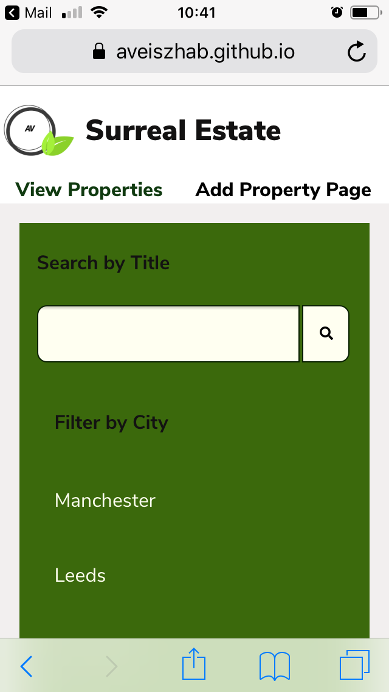
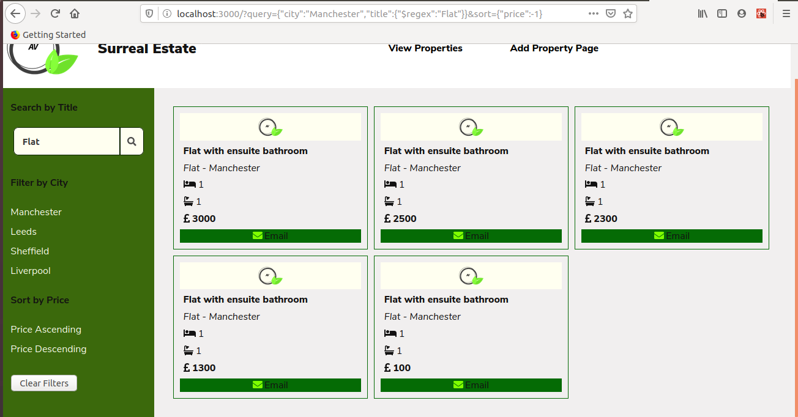

# React Surreal Estate

It is a React property search engine that will have multiple pages:

* A listings page where you can search for different properties and sort/filter the results.

* An add property page where you will add new properties.

## Concepts to be used
* Single Page Application (SPA)

* Client-side Routing

* Controlled Inputs

* HTTP Requests

* API Interaction

* OAuth

## Database 
For this project, Manchester Codes created an API for the course. It is an CRUD REST API which interacts with a MongoDB database. The API was deployed by myself to be able to use it publicly on Heroku.
# Deployment
App was deployed on GitHub pages

https://aveiszhab.github.io/surreal-estate/

# Screenhots

## Mobile

## Desktop

 TBC

# Development utilities used:

* The App was built using REACT
* Testing: Jest, React Testing Library
* Packages: Axios, PropTypes, qs

# To run the App locally

* Clone the repo:
git clone git@github.com:aveiszhab/surreal-estate.git`

* Open the app on localhost:
npm start 

* Start searching for properties by title, filter them down by town and sort them by price

# Possible improvements:
* Single sign on
* Favourites

# Author:
Aniko Veiszhab

